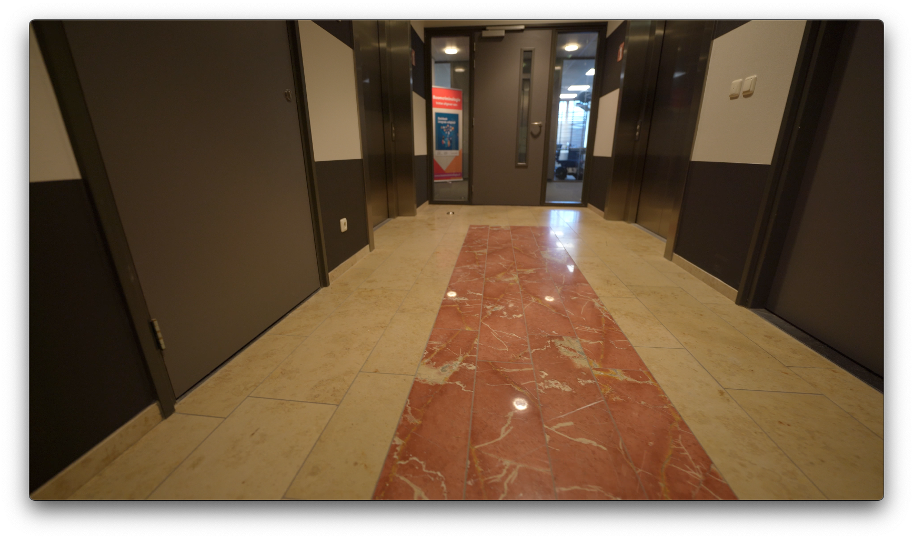
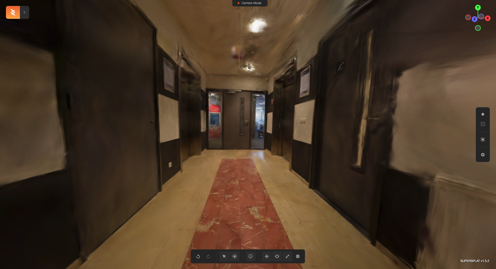

# 3D Gaussian Splatting

This repository contains code for applying 3D Gaussian Splatting to video inputs. It is based on the original implementation by [graphdeco-inria](https://github.com/graphdeco-inria/gaussian-splatting).

## Overview

This project extends the 3D Gaussian Splatting technique to work with video inputs, allowing for the creation of 3D representations from video data. It processes a video file and generates a 3D Gaussian Splatting PLY file as output.

## Usage

To run the code, use the following command:
`python converter.py -v [video_path] [-fps [extraction_rate]] [-ba [skip_ba]] `

Where:
- `-v [video_path]` is the path to your input video file
- `-fps [extraction_rate]` is the desired frame extraction rate in frames per second (optional)
- `-ba [skip_ba]` is to skip incremental mapping and global bundle adjustment process (optional, default 0)

After processing, the script will provide a path to the generated 3D Gaussian Splatting `.ply` file.

## Example

| Input | Output |
|:-----:|:------:|
|  |  |
| *Example frame from input video* | *Visualization of the generated 3D Gaussian Splatting PLY file* |
